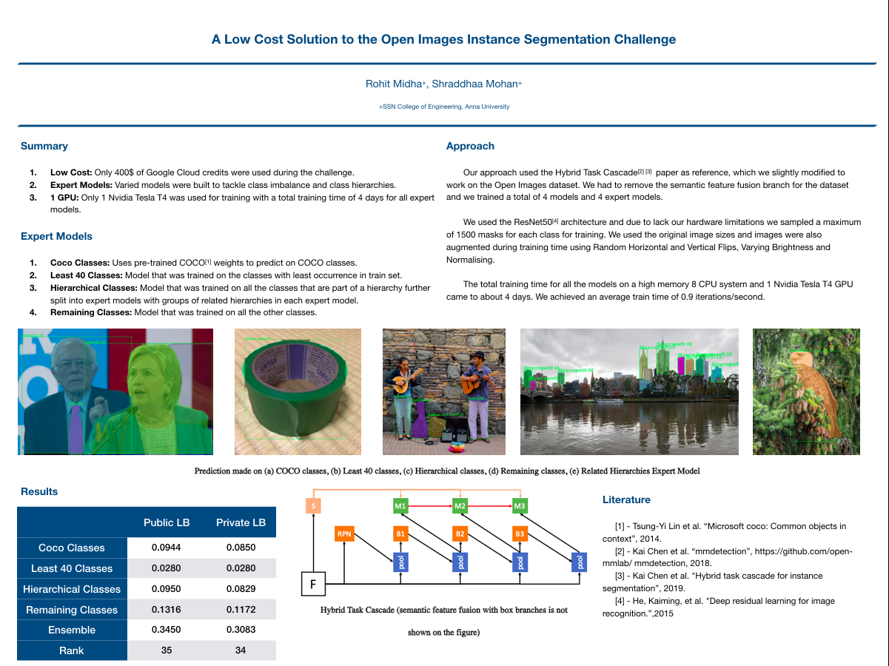

# Open Images Instance Segmentation Challenge 2019

This repository contains the poster that was accepted by [Google](www.google.com) for presentation at the Open Images track at International Conference on Computer Vision, 2019.

A PDF version can be found [here](https://github.com/icarus-team/Open-Images-Instance-Segmnentation-2019/blob/master/OpenImages%20Poster.pdf).
